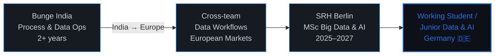

<div align="center">

**MSc Big Data & AI** · SRH Berlin · Ex-Bunge (2.5 yrs) · Open to roles in Germany 🇩🇪

[](mailto:prateekv702@gmail.com)
[](https://linkedin.com/in/YOUR-LINKEDIN)
[](https://github.com/YOUR-USERNAME)

</div>

---

### `> whoami`

```text
Role        : MSc Student in Big Data & AI @ SRH Berlin
Experience  : 2.5 yrs — Data Ops & Process Automation @ Bunge (India → Europe)
Focus       : Data Pipelines · ML Systems · LLM Applications · Cloud Analytics
Looking for : Working Student / Junior roles in Data & AI — Berlin / Remote
```

I've handled **10,000+ invoices/month** in production pipelines, built dashboards used by European business teams, and shipped automation that replaced manual workflows. Now I'm going deeper — building RAG systems, training ML models on real German energy data, and getting hands-on with cloud-native data stacks.

---

### `> tech_stack`

<table>
<tr>
<td align="center" width="25%">

**Languages & Core**


</td>
<td align="center" width="25%">

**Data & ML**


</td>
<td align="center" width="25%">

**AI & LLM**


</td>
<td align="center" width="25%">

**Cloud & Tools**


</td>
</tr>
</table>

<details>
<summary><b>Full stack breakdown →</b></summary>
<br>

| Category | Technologies |
|:--|:--|
| **Data Engineering** | ETL Pipelines · Medallion Architecture (Bronze/Silver/Gold) · Data Validation · Staging Tables |
| **Cloud & Warehousing** | AWS Athena · AWS SageMaker · AWS QuickSight · Snowflake · PostgreSQL · SQLite |
| **ML & Deep Learning** | Regression · Classification · DBSCAN Clustering · RNN · BiLSTM · Feature Engineering |
| **NLP & GenAI** | LangChain · RAG · Vector Databases · Prompt Engineering · Intent Classification |
| **Visualization** | Power BI · Matplotlib · Seaborn · Plotly |
| **DevOps & Workflow** | Git · GitHub · Linux · REST APIs · SAP (exposure) |

</details>

---

### `> projects`

<table>
<tr>
<td width="50%">

#### 📊 Business KPI Analytics & ETL System
Scalable **Python + SQL ETL pipelines** feeding Power BI dashboards for operational KPI tracking. Replaced manual Excel reporting with automated monthly workflows and reusable staging tables.

`Python` `SQL` `Power BI` `ETL` `Data Modeling`

[](https://github.com/YOUR-USERNAME/REPO)

</td>
<td width="50%">

#### 🤖 E-Commerce AI Support Chatbot
End-to-end **RAG chatbot** using LangChain + vector search. Multilingual query handling, context-aware retrieval, structured fallback logic, and intent classification via RNN/BiLSTM.

`LangChain` `RAG` `NLP` `BiLSTM` `Vector DB`

[](https://github.com/YOUR-USERNAME/REPO)

</td>
</tr>
<tr>
<td width="50%">

#### ⚡ Berlin Electricity Demand & Climate Risk
ML regression models correlating **DWD weather data** with Berlin's electricity demand. Identified temperature-driven risk thresholds and seasonal demand patterns.

`Scikit-learn` `Pandas` `DWD Open Data` `Regression`

[](https://github.com/YOUR-USERNAME/REPO)

</td>
<td width="50%">

#### 🔬 DBSCAN Clustering — Research Paper
Academic research implementing **density-based spatial clustering** from scratch. Benchmarked against K-Means on real datasets with formal analysis and documentation.

`Python` `NumPy` `Clustering` `Research`

[](https://github.com/YOUR-USERNAME/REPO)

</td>
</tr>
<tr>
<td colspan="2">

#### 🧠 Intelligent Ops & Incident Assistant (Concept)
Designed an **LLM-powered incident triage system** — classifies automation failures from log data, generates root cause summaries, and routes incidents to reduce manual investigation in enterprise environments.

`LLM APIs` `Prompt Engineering` `Log Analysis` `System Design`

[](https://github.com/YOUR-USERNAME/REPO)

</td>
</tr>
</table>

---

### `> stats`

<div align="center">


</div>

<div align="center">


</div>

---

### `> career`



**At Bunge** — Managed vendor data pipelines across European teams. Built invoice automation processing 10K+ documents/month. Created operational dashboards in Power BI. Won BBS Star Award (Customer Centricity) and Employee of the Month (Automation Excellence).

**At SRH Berlin** — Deep-diving into ML, NLP, cloud-native data architectures, and applied GenAI. Building projects with real German datasets (DWD, energy markets) and industry-relevant cloud stacks (AWS, Snowflake).

---

### `> currently_learning`

```python
current_focus = {
    "cloud_data":     ["AWS Athena", "SageMaker", "Snowflake", "Medallion Architecture"],
    "applied_ml":     ["Time-series forecasting", "Feature engineering", "Data drift detection"],
    "genai":          ["Advanced RAG patterns", "LLM evaluation", "Agent frameworks"],
    "job_market":     ["German tech ecosystem", "ATS optimization", "Technical interviews"]
}
```

---

### `> looking_for`

**Working Student** or **Junior roles** in Data Engineering, Data Science, or Applied AI in Berlin / Germany.

I'm drawn to teams that work on real data problems — messy pipelines, production ML, LLM-powered products — where I can bring both operational experience and fresh research skills to the table.

**Let's connect →** [prateekv702@gmail.com](mailto:prateekv702@gmail.com)

---


